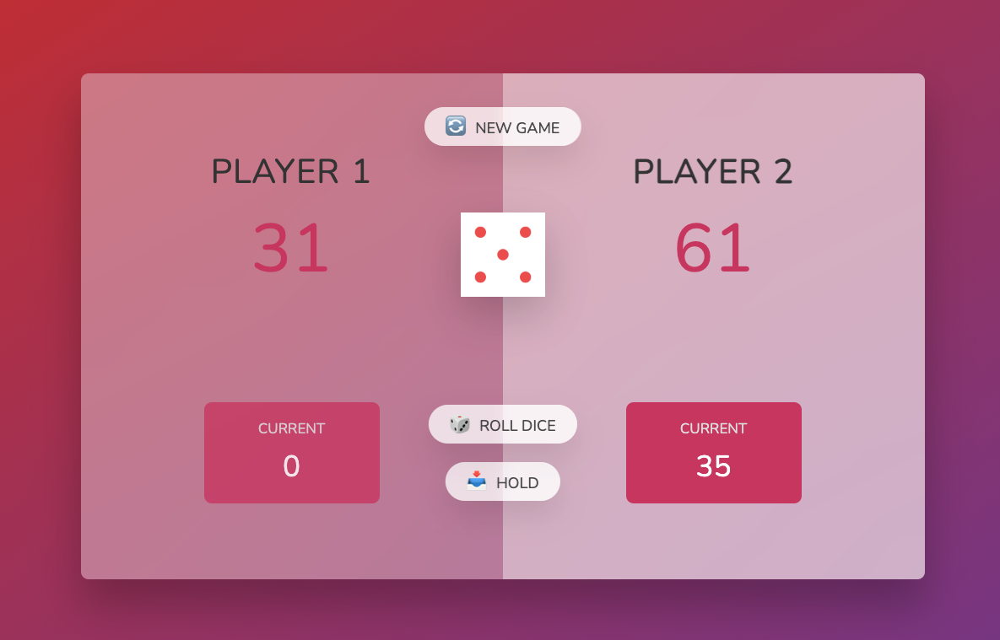
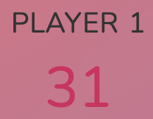
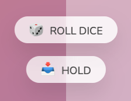
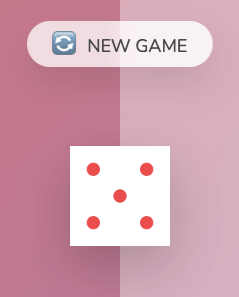

# README
## Pig Game

A dice high scoring clicker game for anyone looking to have a quick round of rejuvenating their index finger.

Built using Javascript, CSS, and HTML, this fun game will keep you and another player on their toes for at least 2 minutes.



<a name="readme-top"></a>

<details>
  <summary>Table of Contents</summary>
  <ul list-style-position="inside">
    <li>
      <a href="#about-the-project">About The Project</a>
      <ul>
        <li><a href="#learning-goals">Learning Goals</a></li>
        <li><a href="#built-with">Built With</a></li>
        <li><a href="#roadmap">Roadmap</a></li>
      </ul>
    </li>
    <li>
      <a href="#getting-started">Getting Started</a>
      <ul>
        <li><a href="#prerequisites">Prerequisites</a></li>
        <li><a href="#installation">Installation</a></li>
      </ul>
    </li>
    <li>
      <a href="#usage">Usage</a>
      <ul>
        <li><a href="#endpoints">Endpoints</a></li>
      </ul>
    </li>
    <li>
      <a href="#contributing">Contributing</a>
      <ul>
        <li><a href="#developers">Developers</a></li>
        <li><a href="#project-managers-instructors">Project Managers-Instructors</a></li>
      </ul>
    </li>
  </ol>
</details>

## About the Project
  
  ### Production Links
  
  * [Github](https://github.com/bgray88/pig_game) <br>

  ### Learning Goals

  * Front end addition to existing Javascript repo
  * Rails implementation of former Javascript repo

  ### Built With

  [![Javascript]][Javascript-url] [![CSS]][CSS-url][![Html]][Html-url]

  ### Roadmap
  <details>
    <summary>Done</summary>
    - [x] Design Schema<br>
    - [x] Add Readme<br>
    - [x] Setup Repo and Push to Github<br>
    - [x] Readme: Outlines the learning goals<br>
    - [x] Readme: Clone and Setup<br>
  </details>
  <details>
    <summary>In Progress</summary>
  </details>

  <p align="right">(<a href="#readme-top">back to top</a>)</p>

## Getting Started

  ### Prerequisites

  * Chrome 113.0.5672.126

  ### Installation

  _Below are instructions for forking and cloning this repo_

  1. Clone the repo
  ```sh
  git clone git@github.com:bGray88/pig_game.git
  ```
  2. Enter the cloned directory
  ```sh
  cd pig_game
  ```
  3. Start the game in browser
  ```sh
  open index.html
  ```
  
  <p align="right">(<a href="#readme-top">back to top</a>)</p>

## Usage
  
  ### Rules
  The player with the highest score is the winner!<br> 
  The first one to 100 points gets the crown;<br>
  Roll the dice until your sure of success, but don't wait too long for if the active player roles a 
  1 then the play switches to the opponent.<br>
  
  ### How to Play
  Click the Roll Dice button until your ready to commit your points to the pit.<br>
  Click the Hold button to accumulate your points to your score.<br>
  The first player to 100 wins the game. Have fun!<br>
  
  
  
  
  
  

  <p align="right">(<a href="#readme-top">back to top</a>)</p>

## Contributing

  Contributions are what make the open source community such an amazing place to learn, inspire, and create. Any contributions you make are **greatly appreciated**.

  If you have a suggestion that would make this better, please fork the repo and create a pull request. You can also simply open an issue with the tag "enhancement".
  Don't forget to give the project a star! Thanks again!

  1. Fork the Project
  2. Create your Feature Branch (`git checkout -b feature/AmazingFeature`)
  3. Commit your Changes (`git commit -m 'Add some AmazingFeature'`)
  4. Push to the Branch (`git push origin feature/AmazingFeature`)
  5. Open a Pull Request

  ### Developers

  <div align="center">
    
    <p align="center">
      Brandon Gray<br>
      <a href="https://github.com/bGray88">Github: bGray88</a><br>
      <a href="https://www.linkedin.com/in/brandon-gray-67903689/">LinkedIn: Brandon Gray</a>
    </p>
  </div>

  <p align="right">(<a href="#readme-top">back to top</a>)</p>

  [Javascript]: https://img.shields.io/badge/-JavaScript-323330?style=flat&logo=javascript&logoColor=F7DF1E
  [Javascript-url]: https://www.javascript.com/
  [CSS]: https://img.shields.io/badge/-CSS3-1572B6?style=flat&logo=css3&logoColor=white
  [CSS-url]: https://www.w3.org/Style/CSS/Overview.en.html
  [Html]: https://img.shields.io/badge/-HTML5-E34F26?style=flat&logo=html5&logoColor=white
  [Html-url]: [https://www.postgresql.org/](https://developer.mozilla.org/en-US/docs/Web/HTML/Element/main)
